# MYSQL - Управление транзакциями


## Определение транзакции в базе данных, примеры 

Транзакция представляет собой группу запросов SQL, обрабатываемых атомарно, то есть как единое целое. Если подсистема базы данных может выполнить всю груп­пу запросов, она делает это, но если какой-либо запрос не может быть выполнен в результате сбоя или по иной причине, ни один запрос группы не будет выполнен. Все или ничего.

Банковское приложение является классическим примером, демонстрирующим необходимость транзакций. Представьте банковскую базу данных с двумя табли­цами: checking (текущие счета) и savings (сберегательные счета). Чтобы перевести 200 долларов с текущего счета Джейн на ее сберегательный счет, вам нужно сделать по меньшей мере три шага.

    Убедиться, что остаток на ее текущем счете больше 200 долларов.
    Вычесть 200 долларов из остатка текущего счета.
    Добавить 200 долларов к остатку сберегательного счета.

Вся операция должна быть организована как транзакция, чтобы в случае неудачи на любом из трех этапов все выполненные ранее шаги были отменены.

Вы начинаете транзакцию командой START TRANSACTION, а затем либо сохраняете изменения командой COMMIT, либо отменяете их командой ROLLBACK. Код SQL для транзакции может выглядеть следующим образом:

```json

START TRANSACTION;
SELECT balance FROM checking WHERE customer_id = 10233276;
UPDATE checking SET balance = balance - 200.00 WHERE customer_id = 10233276;
UPDATE savings SET balance = balance + 200.00 WHERE customer_id = 10233276;
COMMIT;

```

## Уровни изолированности

Изолированность — более сложное понятие, чем кажется на первый взгляд. Стан­дарт SQL определяет четыре уровня изолированности с конкретными правилами, устанавливающими, какие изменения видны внутри и за пределами транзакции, а какие — нет. Более низкие уровни изолированности обычно допускают большую степень конкурентного доступа и влекут за собой меньшие издержки.

    Все подсистемы хранения данных реализуют уровни изолированности немного по-разному, и они не всегда будут соответствовать вашим ожиданиям, если вы привыкли к другой СУБД (здесь не будем вдаваться в подробности). Следует ознакомиться с руководствами по тем подсистемам хранения данных, которые вы решите использовать.

Вкратце рассмотрим четыре уровня изолированности.

    - **READ UNCOMMITTED**. На этом уровне изолированности транзакции могут видеть результаты незавершенных транзакций. Вы можете столкнуться с множеством проблем, если не знаете абсолютно точно, что делаете. Используйте этот уровень, только если у вас есть на то веские причины. На практике этот уровень применя­ется редко, поскольку в этом случае производительность лишь немного выше, чем на других уровнях, имеющих множество преимуществ. Чтение незавершенных данных называют еще черновым, или «грязным» чтением (dirty read).
    
    - **READ COMMITTED**. Это уровень изолированности, который устанавливается по умолча­нию в большинстве СУБД (но не в MySQL!). Он соответствует приведенному ранее простому определению изолированности: транзакция увидит только те изменения, которые к моменту ее начала подтверждены другими транзакциями, а произведен­ные ею изменения останутся невидимыми для других транзакций, пока текущая не будет подтверждена. На этом уровне возможно так называемое неповторяющееся чтение (nonrepeatable read). Это означает, что вы можете выполнить одну и ту же команду дважды и получить разный результат.
    
    - **REPEATABLE READ**. Этот уровень изолированности позволяет решить проблемы, ко­торые возникают на уровне READ 
    
    - **UNCOMMITTED**. Он гарантирует, что любые строки, которые считываются транзакцией, будут выглядеть одинаково при последовательных операциях чтения в пределах одной транзакции, однако теоретически на этом уровне возможна другая проблема, которая называется фантомным чтением (phantom reads). Проще говоря, фантомное чтение может произойти в случае, если вы выбираете некоторый диапазон строк, затем другая транзакция вставляет в него новую строку, после чего вы снова выбираете тот же диапазон. В результате вы увидите новую, фантомную строку. InnoDB и XtraDB решают проблему фантомного чтения с помощью многоверсионного управления конку­рентным доступом (multiversion concurrency control). Уровень изолированности REPEATABLE READ устанавливается в MySQL по умол­чанию.
    
    - **SERIALIZABLE**. Самый высокий уровень изолированности, который решает про­блему фантомного чтения, заставляя транзакции выполняться в таком порядке, чтобы исключить возможность конфликта. Если коротко, уровень SERIALIZABLE блокирует каждую читаемую строку. На этом уровне может возникать множество задержек и конфликтов блокировок. Нам редко встречались люди, использующие этот уровень, но потребности вашего приложения могут заставить применять его, смирившись с меньшей степенью конкурентного доступа, но обеспечивая стабильность данных.


<kbd>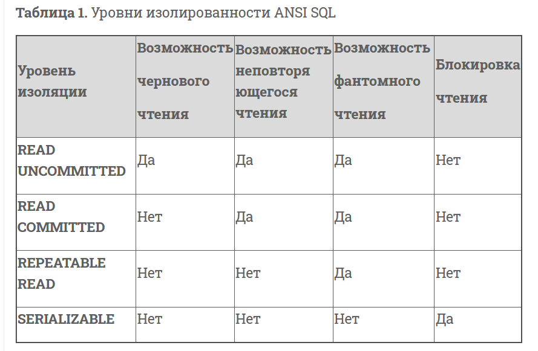</kbd>
<p style="text-align: center;">pic-01</p>


## Транзакции с MySQL

MySQL предоставляет пользователям две транзакционные подсистемы хранения данных: InnoDB и NDB Cluster. Существует также несколько подсистем сторонних разработчиков. Наиболее известны сейчас XtraDB и РВХТ. В следующем разделе мы обсудим некоторые свойства каждой из них.

 
### AUTOCOMMIT

По умолчанию MySQL работает в режиме AUTOCOMMIT. Это означает, что, пока вы не начали транзакцию явно, каждый запрос автоматически выполняется в отдельной транзакции. Вы можете установить или отключить режим AUTOCOMMIT для текущего соединения, задав значение переменной:

 
```text
mysql> SНOW VARIABLES LIKE 'AUTOCOМMIT';
+---------------+-------+
1 VariaЫe_name 1 Value 1
+---------------+-------+
1 autocommit 1 ON
+---------------+-------+
1 row in set (0.00 sec)
mysql> SET AUTOCOМMIT = 1;
```

Значения 1 и ON эквивалентны, так же как 0 и OFF. После отправки запроса в режиме AUTOCOMMIT=0 вы оказываетесь в транзакции, пока не выполните команду COMMIT или ROLLBACK. После этого MySQL немедленно начинает новую транзакцию. Изменение значения переменной AUTOCOMMIT не влияет на нетранзакционные таблицы, такие как MyISAM или Memory, которые не имеют понятия о подтверждении или отмене транзакций.

Некоторые команды, будучи запущенными во время начатой транзакции, застав­ляют MySQL подтвердить транзакцию до их выполнения. Обычно это команды языка определения данных (Data Definition Language, DDL), которые вносят изменения в структуру таблиц, например ALTER TABLE, но LOCK TABLES и другие директивы также обладают этим свойством. В документации к своей версии MySQL вы можете найти полный список команд, автоматически фиксирующих транзакцию.

MySQL позволяет устанавливать уровень изолированности с помощью команды SET TRANSACTION ISOLATION LEVEL, которая начинает действовать со следующей транзак­ции. Можете настроить уровень изолированности для всего сервера в конфигураци­онном файле или только для своей сессии:

```bash

mysql> SET SESSION TRANSACTION ISOLATION LEVEL READ COMMITTED;

```

MySQL распознает все четыре стандартных уровня изоляции ANSI, a InnoDB все их поддерживает.

 
Использование нескольких подсистем хранения данных в транзакциях

MySQL не управляет транзакциями на уровне сервера. Вместо этого подсистемы хра­нения данных реализуют транзакции самостоятельно. Это означает, что вы не можете надежно сочетать различные подсистемы в одной транзакции.

Если вы используете транзакционные и нетранзакционные таблицы (например, та­блицы InnoDB и MyISAM) в одной транзакции, то все будет работать хорошо, пока не произойдет что-то неожиданное.

Однако если потребуется выполнить откат, то невозможно будет отменить измене­ния, внесенные в нетранзакционную таблицу. Из-за этого база данных становится несогласованной, и восстановить ее после такого события нелегко, что ставит под сомнение идею транзакций в целом. Вот почему так важно выбирать для каждой таблицы подходящую подсистему хранения.

MySQL обычно не предупреждает и не выдает сообщений об ошибках, если вы вы­полняете транзакционные операции над нетранзакционной таблицей. Иногда при откате транзакции может быть сгенерировано предупреждение Some nontransactional changed tables couldn't be rolled back (Откат некоторых измененных нетранзакционных таблиц невозможен), но большую часть времени вы не будете знать о том, что рабо­таете с нетранзакционными таблицами.

 
### Явные и неявные блокировки

В подсистеме хранения InnoDB применяется двухфазный протокол блокировки. Она может устанавливать блокировки в любой момент транзакции, но не снимает их до выполнения команд COMMIT или ROLLBACK. Все блокировки снимаются одновременно. Ранее описанные механизмы блокировки являются неявными. InnoDB обрабатывает блокировки автоматически в соответствии с вашим уровнем изоляции.

Однако InnoDB поддерживает и явную блокировку, которая в стандарте SQL вообще не упоминается:

```sql


    SELECT . .. LOCK IN SHARE MODE;
    SELECT ... FOR UPDATE.

```

MySQL также поддерживает команды LOCK TABLES и UNLOCK TABLES, которые реали­зуются на сервере, а не в подсистеме хранения. Они применяются в определенных случаях, но не служат заменой транзакциям. Если вам нужны транзакции, исполь­зуйте транзакционную подсистему хранения.

Нам часто попадаются приложения, которые были перенесены из MyISAM в InnoDB, но в которых по-прежнему используется команда LOCK TABLES. В этой команде боль­ше нет необходимости, так как применяются построчные блокировки, а проблемы с производительностью она может вызывать серьезные. 

    Команда LOCK TABLES плохо взаимодействует с транзакциями, и в некоторых
    версиях сервера и те и другие ведут себя непредсказуемо. Поэтому мы
    рекомендуем применять команду LOCK TABLES только в рамках транзакции
    с режимом AUTOCOMMIT независимо от того, какой подсистемой хранения вы
    пользуетесь.


## LAB-1 ДЕмонтсрация механизма управления транзакциями

Для упралвения треназакциями сделана домашняя работа из LAB-01
- Структура базы данных  в скрипте: db-build.sql 

Для первичной загрузки  записей в базу данных использовано проецедурное расширение MYSQL
- написана процедура для вставки записей в  таблицу BRANCH db-proc-01.sql
- написан процедура, которая итерирует по  таблице BRACH и вставляет записи в табоицу клиентов db-proc-02.sql. При итерации по таблице BRANCH  используется такое понятие как курсор.

### Отображение транзакций в режиме автоматического commit;

Для проведения работы необходиом запустить 2 сеанса консольного клиента

<kbd>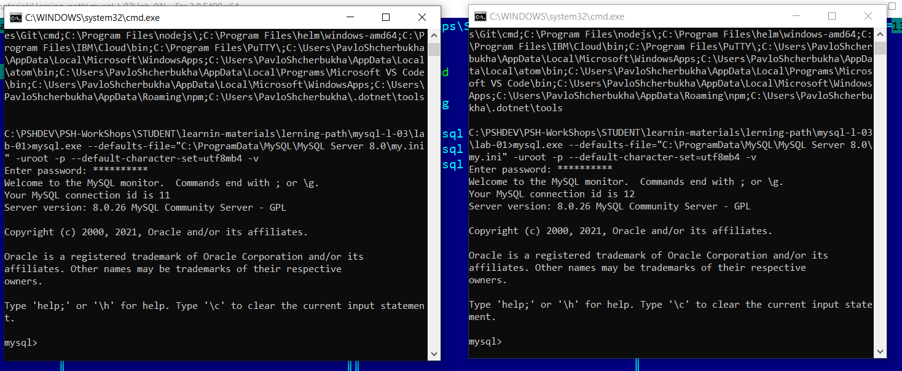</kbd>
<p style="text-align: center;">pic-02</p>

ЗАпрос из таблички филиалов показывает, что записей в тадице нет.

<kbd>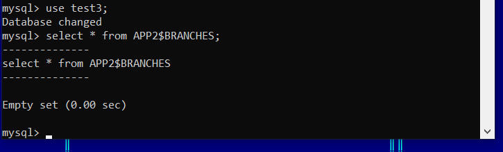</kbd>
<p style="text-align: center;">pic-03</p>

Теперь, выполним, процедуры импорта, которые описаны в скрипте: **exec-02.sql**.

<kbd>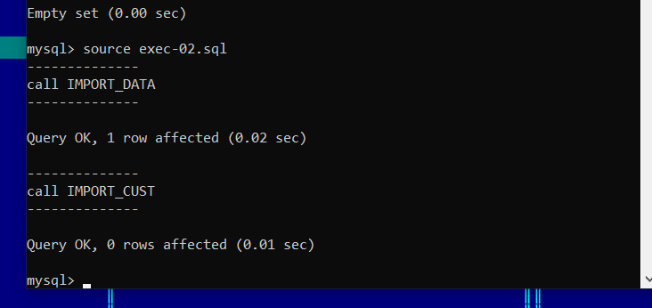</kbd>
<p style="text-align: center;">pic-04</p>

Тут видим что процедуры выполнились без ошибок и в таблице отделений и филиалов есть записи

<kbd>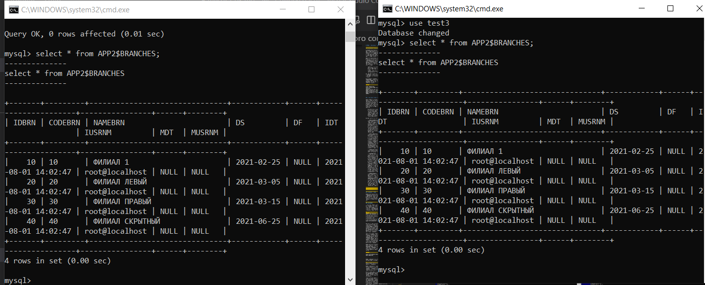</kbd>
<p style="text-align: center;">pic-05</p>

в обеих сеансах.

Теперь удалим все записи и убедимся что оба сеанса моментально заметили эти изменения.

<kbd>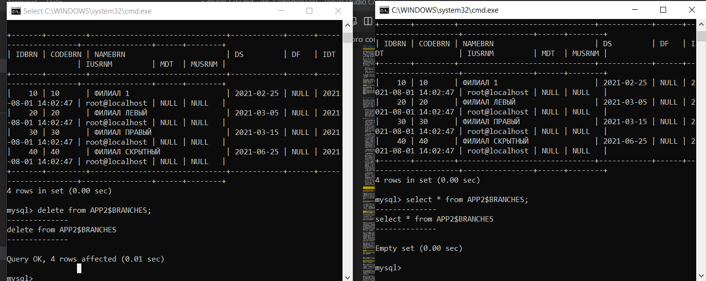</kbd>
<p style="text-align: center;">pic-06</p>

### Отображенгие транзакций в режиме ISOLATION LEVEL READ COMMITTED

Для этого запустим скрипт **exec-03.sql**
В єтом скрипт сеанс переводится в режим ручного управления транзакцией

```sql
SET SESSION TRANSACTION ISOLATION LEVEL READ COMMITTED;
START TRANSACTION;
call IMPORT_DATA;
call IMPORT_CUST;

```

Скрипт успешно выполнился.
<kbd>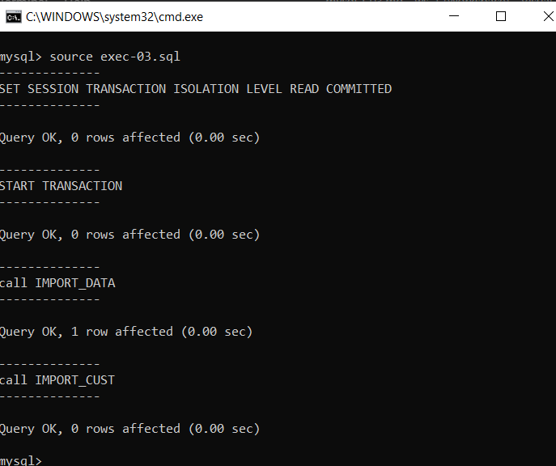</kbd>
<p style="text-align: center;">pic-07</p>


Теперь сделаем select  из обеих сеансов

<kbd>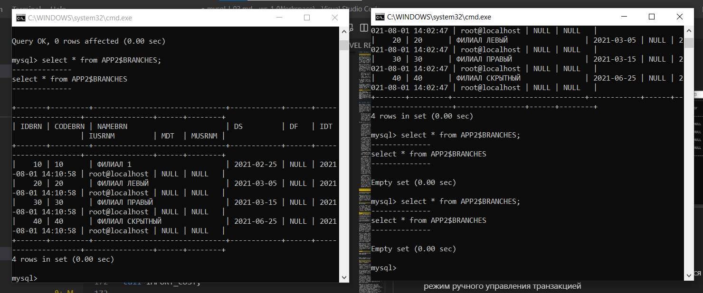</kbd>
<p style="text-align: center;">pic-08</p>

В правом сеансе, где выполнлся скрипт записи уже есть. А в правом сеансе - нет еще записей. Это обьясняется тем, что в правом окне транзакция не закоммичена (не закончена).

Как только выполнили commit и закончили транзакцию, записи сразу стали доступны для дургого сеанса:

<kbd>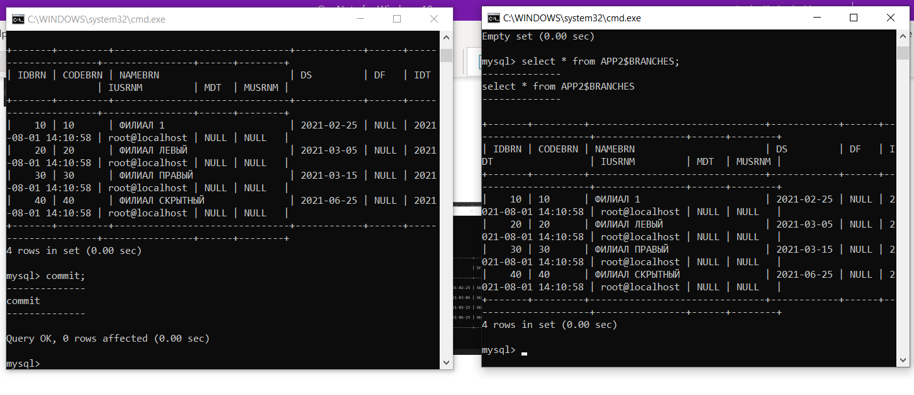</kbd>
<p style="text-align: center;">pic-09</p>

В реальности, в даной лабораторной мы вносили записи в 2 таблицы и результаты вставки были не доступны  другому сеансу, до тех пор, пока не был выполнен coomit, сигнализирующйи о завершении трназакции.

### Блокирование записи в таблице

При выполнении операций над базами данных очень часто возникает заблокировать запись или несколько  записей перед выполненим операций над записями БД.
Ну, на пример, при выполнении опреаций межуд счетами, нужно заблакировать записи со счетами, чтобы никто не попытался удалить или  изменить эти записи.

Для этого используется конструкция 

```text
 SELECT ... FOR UPDATE.

 ```

В даном примере  в левом окне выполнено начало транзакции и выполнен select с предикатом "FOR UPDATE"

 <kbd></kbd>
<p style="text-align: center;">pic-09</p>

А в правом сеансе попытались изенить  эту же запись.  ЗАписб долго "висела", ожидая пока   запись освободиться. А потом транзакция отвалилась с ошибкой об окончании вермени ожидания. при этом запись свобоно читается.
 <kbd>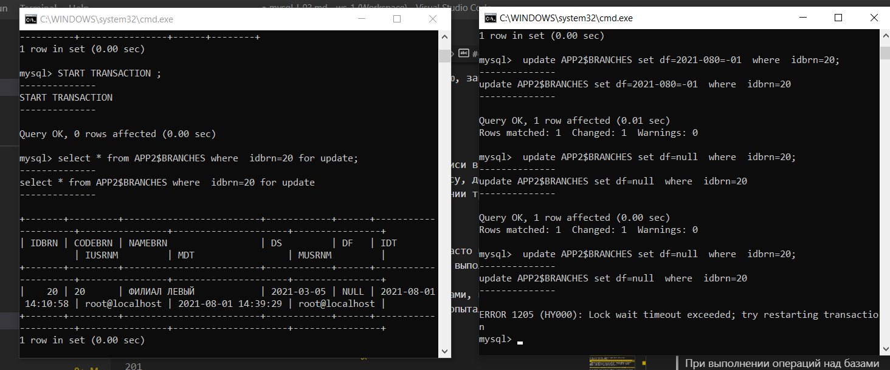</kbd>
<p style="text-align: center;">pic-10</p>
А вот если в левом окне выполнить commit или rollback -  то транзакция закончится и в правом окне можно будет выполнить update.

 <kbd>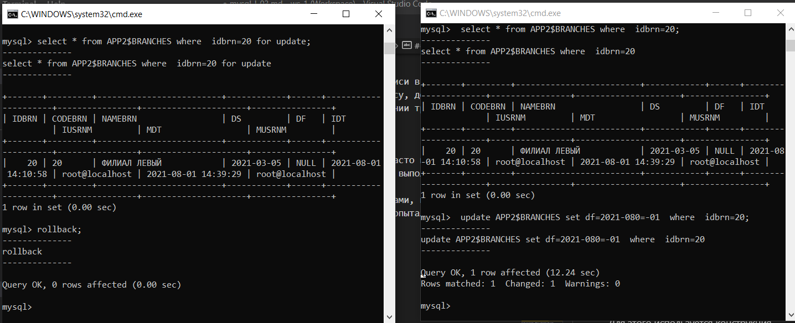</kbd>
<p style="text-align: center;">pic-11</p>


## LAB-2 Построение  транзакционной системы учета

Используя данные предыдущего домашнеого задания можно построить прототип банковской системы обработки транзакций

У нас есть справочник отдлений. Есть  массив клиентов.  Теперь построим систему переводов денег между клиентами.
Для этого в таблицу клиентов добавим поле с суммой остатка денег у клиента. И содадим еще одну таблицу - журнал операций.
Ну и для обработки  транзакций в  журнале операций -  напишем функций БД, которая выполняет процессинг операций.

- создадим таблицу транзакций и триггера к ней

Необходимо обратить внимание что в таблице транзакций
есть 2 внешних ключа на таблицу APP2$CUST. C  одного клиента деньги списывем, а  дургому - зачисляем.

Так же следует опратить внимание, что в даной талдице есть поле статуса PROC_STATUS,  кторое может принимать такие значения:

- N -  NEW новая не процесиированая транзакция
- P -  PROCESSED обработанная (спроцессированная) транзакция
- B -  BRACK  Отбраковааная транзакция, если возникла ошикба при процессироаниии транзкции
- R -  READY, транзакция готова для процссирования

Так же необходимо обратьб внимание на триггер Before update. В нем есть часть бизнеслогики, когда автоматически запоняется поле PROC_DTTM ( дата время процессирования транзакции). Во всех другиз статусах это поле сбрасывается в NULL.


```sql

CREATE TABLE APP2$TRN
(
    TRNID       INT AUTO_INCREMENT,
    DTTRN       DATE,
    DBT_CUSTID  INT,
    KRD_CUSTID  INT,
    SUM         DECIMAL(9,2),
    TRM_COMMENT VARCHAR(50),
    PROC_STATUS VARCHAR(1),
    PROC_ERR    VARCHAR(2),
    PROC_DTTM   DATETIME, 
    IDT         DATETIME,
    IUSRNM      VARCHAR(32),
    MDT         DATETIME,
    MUSRNM      VARCHAR(32),
    CONSTRAINT APP2$TRN_PK PRIMARY KEY( TRNID ),
    CONSTRAINT APP2$TRN_DTTRN_NNL CHECK( DTTRN IS NOT NULL ) ,
    CONSTRAINT APP2$TRN_DBT_CUSTID_FK FOREIGN KEY ( DBT_CUSTID )  REFERENCES APP2$CUST ( CUSTID ),
    CONSTRAINT APP2$TRN_KRD_CUSTID_FK FOREIGN KEY ( KRD_CUSTID )  REFERENCES APP2$CUST ( CUSTID ),
    CONSTRAINT APP2$TRN_SUM_NNL CHECK( SUM IS NOT NULL   ) ,
    CONSTRAINT APP2$TRN_SUM_RNG CHECK( SUM >= 0   ) ,
    CONSTRAINT APP2$TRN_PROC_STS_NNL CHECK( PROC_STATUS IS NOT NULL   ) ,
    CONSTRAINT APP2$TRN_PROC_STS_RNG CHECK( PROC_STATUS IN ('N', 'R', 'P', 'B')   ) ,
    CONSTRAINT APP2$TRN_IDT_NNL      CHECK(IDT IS NOT NULL),
    CONSTRAINT APP2$TRN_IUSRNM_NNL   CHECK(IUSRNM IS NOT NULL)
    
);

-- ======================================================================
-- =============== СОЗДАЮ ТРИГЕРА НА  APP2$TRN     =====================

DROP TRIGGER IF EXISTS APP2$TRN_BI_TRG;

delimiter |

CREATE TRIGGER APP2$TRN_BI_TRG BEFORE INSERT ON APP2$TRN
  FOR EACH ROW
  BEGIN
    SET NEW.IDT = CURRENT_TIMESTAMP();
    SET NEW.IUSRNM = USER();
    SET NEW.PROC_STATUS = 'N';
    
  END;
|

delimiter ;


DROP TRIGGER IF EXISTS APP2$TRN_BU_TRG;

delimiter |

CREATE TRIGGER APP2$TRN_BU_TRG BEFORE UPDATE ON APP2$TRN
  FOR EACH ROW
  BEGIN
    SET NEW.MDT = CURRENT_TIMESTAMP();
    SET NEW.MUSRNM = USER();
    IF NEW.PROC_STATUS='P' THEN
        SET NEW.PROC_DTTM = CURRENT_TIMESTAMP();
    ELSE 
        SET NEW.PROC_DTTM = NULL;
    END IF;
  END;
|

delimiter ;


```


В файлах 
- db-proc-01.sql, db-proc-02.sql   находятся процедуры первичной загрузки данных в таблицы.

- db-proc-03.sql  находится серверная процедура процессирования одной трназакции.

- proc-trn-01.sql содержит вставку тестовых транзакций

- proc-trn-01.sql пример вызова процедуры процессинга транзакций. 


В db-proc-03.sql следует обратить внимание на то, что в опреации select  используется  предикат FOR UPDATE  для блокировки записей. Таким образом, если одн процесс начала обработку транзакции, то другой процесс не сможет ее тоже обработать, до теъ пор, пока первый проуесс не "отпустит" - не снимет блокировки с записей.
Окончание транзакции  выполняется командами SQL commit или rollback. Но в процедурах их нет. Обычно решение принмиается на клиентской части, а не на сервер БД.

```sql

            END IF;

            SET L_STEP = 'ЧИТАЮ ТРАНЗАКЦИЮ ИЗ БД';
            SELECT A.TRNID, A.DTTRN, A.DBT_CUSTID, A.KRD_CUSTID, A.SUM, A.TRM_COMMENT, A.PROC_STATUS
            INTO L_TRNID, L_DTTRN, L_DBT_CUSTID, L_KRD_CUSTID, L_SUM, L_TRM_COMMENT, L_PROC_STATUS
            FROM APP2$TRN A
            WHERE A.TRNID = A_TRNID FOR UPDATE;
            IF L_NOT_FOUND = 1 THEN
                set L_MSG = concat(L_STEP , ': В БД ТРАНЗАКЦИЯ НЕ НАЙДЕНА!');
                signal L_EXCEPTION set message_text = L_MSG;
            END IF;

            SET L_STEP = 'ПРОВЕРЯЮ ДОПУСТИМОСТЬ СТАТУСА ТРАНЗАКЦИИ';
           
            IF L_PROC_STATUS <> 'N' THEN
               set L_MSG = concat(L_STEP , ': НЕ ДОПУСТИМЫЙ СТАТУС ТРАНЗАКЦИИ!');
               signal L_EXCEPTION set message_text = L_MSG;
            END IF;
           
            SET L_STEP = 'ЧИТАЮ ДАННЫЕ КЛИЕНТА ПО ДЕБЕТУ(СПИСАНИЮ)';
            SELECT  D.CUSTID, D.SUM, D.DS, D.DF
            INTO L_DCUSTID, L_DSUM, L_DDS, L_DDF    
            FROM APP2$CUST D
            WHERE D.CUSTID = L_DBT_CUSTID FOR UPDATE;
   
            IF L_NOT_FOUND = 1 THEN
                set L_MSG = concat(L_STEP , ': Клиент по дебету(списанию) не найден !');
                signal L_EXCEPTION set message_text = L_MSG;
            END IF;


```


В proc-trn-01.sql следует обраить внимание на
то, что устанавливается ручное управление транзакциями.

Дальше показн пример одного  из правил соединения нескольких таблци в запросах, который называется Inner JOIN.

```sql
SET SESSION TRANSACTION ISOLATION LEVEL READ COMMITTED;
START TRANSACTION;


select T.TRNID, T.DTTRN, T.SUM, T.PROC_STATUS, D.CUSTID as DBT_CUSTID, D.SUM AS DBTRST, K.CUSTID as KRD_CUSTID, K.SUM AS KRDRST
from app2$trn T
INNER join app2$cust d on d.CUSTID = T.DBT_CUSTID
INNER join app2$cust k on k.CUSTID = T.KRD_CUSTID;


call APP2_TRNPROC(NULL);


call APP2_TRNPROC(333);


call APP2_TRNPROC(1);


call APP2_TRNPROC(2);

select T.TRNID, T.DTTRN, T.SUM, T.PROC_STATUS, D.CUSTID as DBT_CUSTID, D.SUM AS DBTRST, K.CUSTID as KRD_CUSTID, K.SUM AS KRDRST
from app2$trn T
INNER join app2$cust d on d.CUSTID = T.DBT_CUSTID
INNER join app2$cust k on k.CUSTID = T.KRD_CUSTID;


```


Ну а тут показан лог работы скрипта, демонстрирующий как изменяются остатки, как выполняются  проверки.

```text
mysql> source proc-trn-01.sql ;
--------------
SET SESSION TRANSACTION ISOLATION LEVEL READ COMMITTED
--------------

Query OK, 0 rows affected (0.00 sec)

--------------
START TRANSACTION
--------------

Query OK, 0 rows affected (0.00 sec)

--------------
select T.TRNID, T.DTTRN, T.SUM, T.PROC_STATUS, D.CUSTID as DBT_CUSTID, D.SUM AS DBTRST, K.CUSTID as KRD_CUSTID, K.SUM AS KRDRST
from app2$trn T
INNER join app2$cust d on d.CUSTID = T.DBT_CUSTID
INNER join app2$cust k on k.CUSTID = T.KRD_CUSTID
--------------

+-------+------------+------+-------------+------------+---------+------------+---------+
| TRNID | DTTRN      | SUM  | PROC_STATUS | DBT_CUSTID | DBTRST  | KRD_CUSTID | KRDRST  |
+-------+------------+------+-------------+------------+---------+------------+---------+
|     1 | 2021-08-02 | 2.21 | N           |          1 | 1000.56 |          2 | 1000.56 |
|     2 | 2021-08-02 | 1.11 | N           |          1 | 1000.56 |          4 | 1000.56 |
+-------+------------+------+-------------+------------+---------+------------+---------+
2 rows in set (0.00 sec)

--------------
call APP2_TRNPROC(NULL)
--------------

ERROR 1644 (45000): Проверяю входные параметры: Не указан ID  транзакции!
--------------
call APP2_TRNPROC(333)
--------------

ERROR 1644 (45000): ЧИТАЮ ТРАНЗАКЦИЮ ИЗ БД: В БД ТРАНЗАКЦИЯ НЕ НАЙДЕНА!
--------------
call APP2_TRNPROC(1)
--------------

Query OK, 1 row affected (0.00 sec)

--------------
call APP2_TRNPROC(2)
--------------

Query OK, 1 row affected (0.00 sec)

--------------
select T.TRNID, T.DTTRN, T.SUM, T.PROC_STATUS, D.CUSTID as DBT_CUSTID, D.SUM AS DBTRST, K.CUSTID as KRD_CUSTID, K.SUM AS KRDRST
from app2$trn T
INNER join app2$cust d on d.CUSTID = T.DBT_CUSTID
INNER join app2$cust k on k.CUSTID = T.KRD_CUSTID
--------------

+-------+------------+------+-------------+------------+--------+------------+---------+
| TRNID | DTTRN      | SUM  | PROC_STATUS | DBT_CUSTID | DBTRST | KRD_CUSTID | KRDRST  |
+-------+------------+------+-------------+------------+--------+------------+---------+
|     1 | 2021-08-02 | 2.21 | P           |          1 | 997.24 |          2 | 1002.77 |
|     2 | 2021-08-02 | 1.11 | P           |          1 | 997.24 |          4 | 1001.67 |
+-------+------------+------+-------------+------------+--------+------------+---------+
2 rows in set (0.00 sec)

mysql> commit;
--------------
commit
--------------

Query OK, 0 rows affected (0.01 sec)

mysql> source proc-trn-01.sql ;
--------------
SET SESSION TRANSACTION ISOLATION LEVEL READ COMMITTED
--------------

Query OK, 0 rows affected (0.00 sec)

--------------
START TRANSACTION
--------------

Query OK, 0 rows affected (0.00 sec)

--------------
select T.TRNID, T.DTTRN, T.SUM, T.PROC_STATUS, D.CUSTID as DBT_CUSTID, D.SUM AS DBTRST, K.CUSTID as KRD_CUSTID, K.SUM AS KRDRST
from app2$trn T
INNER join app2$cust d on d.CUSTID = T.DBT_CUSTID
INNER join app2$cust k on k.CUSTID = T.KRD_CUSTID
--------------

+-------+------------+------+-------------+------------+--------+------------+---------+
| TRNID | DTTRN      | SUM  | PROC_STATUS | DBT_CUSTID | DBTRST | KRD_CUSTID | KRDRST  |
+-------+------------+------+-------------+------------+--------+------------+---------+
|     1 | 2021-08-02 | 2.21 | P           |          1 | 997.24 |          2 | 1002.77 |
|     2 | 2021-08-02 | 1.11 | P           |          1 | 997.24 |          4 | 1001.67 |
+-------+------------+------+-------------+------------+--------+------------+---------+
2 rows in set (0.00 sec)

--------------
call APP2_TRNPROC(NULL)
--------------

ERROR 1644 (45000): Проверяю входные параметры: Не указан ID  транзакции!
--------------
call APP2_TRNPROC(333)
--------------

ERROR 1644 (45000): ЧИТАЮ ТРАНЗАКЦИЮ ИЗ БД: В БД ТРАНЗАКЦИЯ НЕ НАЙДЕНА!
--------------
call APP2_TRNPROC(1)
--------------

ERROR 1644 (45000): ПРОВЕРЯЮ ДОПУСТИМОСТЬ СТАТУСА ТРАНЗАКЦИИ: НЕ ДОПУСТИМЫЙ СТАТУС ТРАНЗАКЦИИ!
--------------
call APP2_TRNPROC(2)
--------------

ERROR 1644 (45000): ПРОВЕРЯЮ ДОПУСТИМОСТЬ СТАТУСА ТРАНЗАКЦИИ: НЕ ДОПУСТИМЫЙ СТАТУС ТРАНЗАКЦИИ!
--------------
select T.TRNID, T.DTTRN, T.SUM, T.PROC_STATUS, D.CUSTID as DBT_CUSTID, D.SUM AS DBTRST, K.CUSTID as KRD_CUSTID, K.SUM AS KRDRST
from app2$trn T
INNER join app2$cust d on d.CUSTID = T.DBT_CUSTID
INNER join app2$cust k on k.CUSTID = T.KRD_CUSTID
--------------

+-------+------------+------+-------------+------------+--------+------------+---------+
| TRNID | DTTRN      | SUM  | PROC_STATUS | DBT_CUSTID | DBTRST | KRD_CUSTID | KRDRST  |
+-------+------------+------+-------------+------------+--------+------------+---------+
|     1 | 2021-08-02 | 2.21 | P           |          1 | 997.24 |          2 | 1002.77 |
|     2 | 2021-08-02 | 1.11 | P           |          1 | 997.24 |          4 | 1001.67 |
+-------+------------+------+-------------+------------+--------+------------+---------+
2 rows in set (0.00 sec)

mysql>

```